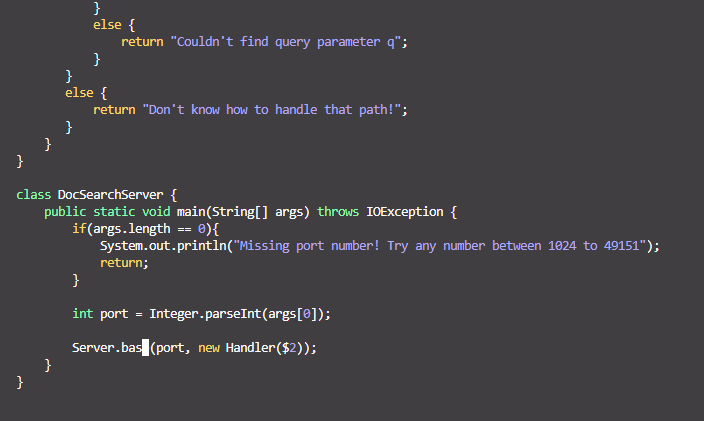

# Lab Report 4: Weeks 6 & 7 

***Contents:***
- Part 1: Week 6
    - Shortest amount of keystrokes
- Part 2: Reporting Workflow

---------------

## **Part 1: Week 6**
### Shortest amount of keystrokes

One of our tasks was to change the name of the `start` parameter and its uses to `base` in the `DocSearchServer.java` file AND record our inputs to see how optimized we can get!

>COMMAND SEQUENCE: Total of 21 Inputs

    /start<enter>cwbase<esc>n.n.n.

**START**
>
> unmodified file, without any commands inputed

|Sequence| Image | Inputs| Purpose|
|--|--|--|--|
|/ + s + t + a + r  + `<enter>`| | 6|search for start|
|c + w  | | 2| delete word and enter insert mode|
|b + a + s + e + `<esc>` |  | 5 | type the word `base` and exit insert mode|
|n + `.`||2| go to next instance of `star` and repeat the actions of cw and insert mode entries|
|n + `.`| |2| go to next instance of `star` and repeat the actions of cw and insert mode entries|
|n + `.`| |2| go to next instance of `star` and repeat the actions of cw and insert mode entries|

**END**

_____

## Part 2: Reporting Workflow

We are tasked with comparing two strategies for logging into remote machines, regarding our workflow.

Specifically, we need to consider our sequence we created in Part 1 in the context of getting it to the remote server somehow.

We need to test 2 workflows:
1. Editing our file in VS Code, use `scp` to get it onto the remote server, and run bash test.sh.
2. Starting in an SSH, edit the file and run bash test.sh

|Style|Time Taken|Thoughts|
|---|---|---|
|scp and push Style|50.23 seconds|Trouble with the scp command -> mostly familiarity issues|
|VIM and bash Style|25.82 seconds| pretty fast since I basically did this in part 1|

> Q: Which of these two styles would you prefer using if you had to work on a program that you were running remotely, and why?

I think I would prefer to be on the ssh, since scp is something I think is pretty finicky! (Mostly because I am bad with scp and don't know how to trouble shoot problems like if the connection gets lost and timed out. I cannot fix it!) HOWEVER, I do find VIM to be somewhat inconvenient, so if I know for a fact that scp will work, I would most likely opt to use scp.

> Q: What about the project or task might factor into your decision one way or another? (If nothing would affect your decision, say so and why!)

I think the file size affects my decision to solution the most. If I am trying to scp something VERY BIG I would need to consider... not doing that because it would take awhile. 