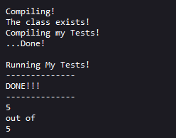

# Lab Report 5: Weeks 8 & 9 & 10 

***Contents:***
- Grading Script
    - Code Block
    - Screenshots
    - Trace

---------------


### Code Block


*THIS IS THE RAW CODEBLOCK! YOU ASKED YOU RECIEVE!*

```# Create your grading script here
clear
echo "Starting Grader!!!"
set -e

# Total points: 
sum=0
# JUnit
declare JUnit=".:lib/hamcrest-core-1.3.jar:lib/junit-4.13.2.jar"


rm -rf student-submission
git clone $1 student-submission


rm -rf grading #emilys code idea!!
mkdir grading


echo "Setup done!"
echo
echo "checking that ListExamples.java files exists"
cd student-submission
# check that all the files exist!
if [ -f ListExamples.java ]
then 
	echo "...It Does!!"
	echo
	((sum+=1))
	cd ..
else
	echo "File Not Found: ListExamples.java"
	echo "DONE!!!"
	echo 1 
	echo "out of"
	echo "5"
	exit 1
fi

cp ./student-submission/ListExamples.java grading
cp TestListExamples.java grading
cp -r lib grading


#enter the new directory
cd grading

# compile listexamples
echo "Compiling!"
javac ListExamples.java


# check that the class now exists
if [[ -f ListExamples.class ]]
then 
	echo "The class exists!"
	((sum=$sum+1))
else
	echo "Class Not Found: ListExamples"
	echo "DONE!!!"
	echo 2 
	echo "out of"
	echo "5"
	exit 1
fi

# TODO: check that the methods exist!


echo "Compiling my Tests!"
# compile my test
javac -cp $JUnit TestListExamples.java
echo "...Done!"

echo 
echo "Running My Tests!"
echo "--------------"
set +e
# run my test
java -cp $JUnit org.junit.runner.JUnitCore TestListExamples > testOutput.txt


var=($(grep "timed out" testOutput.txt | wc -l))

if [ $var -eq 0 ]
then
	((sum+=1))
else
	echo "Time Out Error in a method!!"
fi 

var=($(grep "differed" testOutput.txt | wc -l))
if [ $var -eq 0 ]
then
	((sum+=2))
else
	echo "Elements Differed in a method!!"
fi 


echo "DONE!!!"
echo "--------------"
echo $sum 
echo "out of"
echo "5"
```
    

*END OF CODE BLOCK*

*throws up*


--------

### Screenshots

|Repository|Screenshot of Output|
|---|---|
|https://github.com/ucsd-cse15l-f22/list-methods-lab3||
|https://github.com/ucsd-cse15l-f22/list-methods-corrected||
|https://github.com/ucsd-cse15l-f22/list-methods-filename||


---------

### Trace

We will look at a trace of the first github repository shown above: https://github.com/ucsd-cse15l-f22/list-methods-lab3


|Line|Standard Out/ERR and Return Code|
|----|----|
|clear| return: 0|
|set -e|return: 0|
|declare JUnit=".:lib/hamcrest-core-1.3.jar:lib/junit-4.13.2.jar"|return: 0|
|rm -rf student-submission|return: 0|
|git clone $1 student-submission|return: 0|
|rm -rf grading #emilys code idea!!|return: 0|
|mkdir grading|return: 0|
|cd student-submission|return: 0|
|if [ -f ListExamples.java ]|TRUE |
then <br> echo "...It Does!!"<br> echo <br> ((sum+=1))<br> cd ..|return: 0|
else<br>echo "File Not Found: ListExamples.java"<br>echo "DONE!!!"<br>echo 1 <br>echo "out of"<br>echo "5"<br>exit 1<br>fi|doesnt run|
|cp ./student-submission/ListExamples.java grading|return: 0|
|cp TestListExamples.java grading|return: 0|
|cp -r lib grading|return: 0|
|cd grading|return: 0|
|javac ListExamples.java|return: 0|
|if [[ -f ListExamples.class ]]|TRUE|
|then<br>echo "The class exists!"<br>((sum=$sum+1))<br>|return: 0|
|else<br>	echo "Class Not Found: ListExamples"<br>	echo "DONE!!!"<br>	echo 2 <br>	echo "out of"<br>echo "5"<br>exit 1<br>fi|doesnt run|
|javac -cp $JUnit TestListExamples.java|return: 0|
|set +e|return: 0|
|java -cp $JUnit org.junit.runner.JUnitCore TestListExamples > testOutput.txt||
|var=($(grep "timed out" testOutput.txt &#124; wc -l))|return: 0|
|if [ $var -eq 0 ]|FALSE|
|then<br>	((sum+=1))|doesnt run|
|else<br>	echo "Time Out Error in a method!!"<br>fi |return: 0|
|var=($(grep "differed" testOutput.txt &#124; wc -l))|return: 0|
|if [ $var -eq 0 ]|FALSE|
|then<br>	((sum+=2))|doesnt run|
|else<br>	echo "Elements Differed in a method!!"<br>fi|return: 0|


I hope that was what you wanted :skull:
