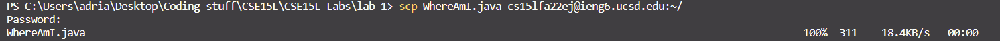
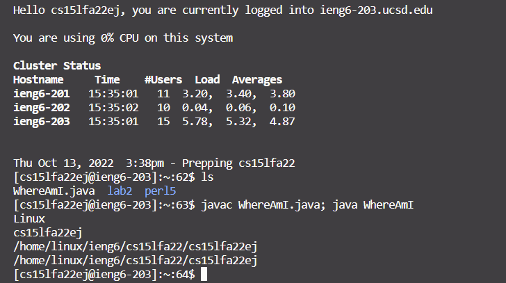
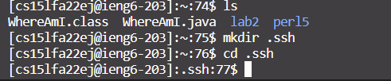
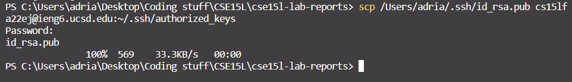
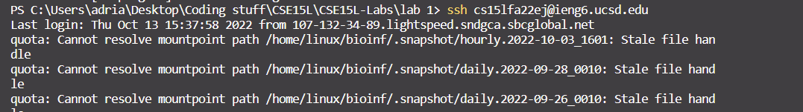
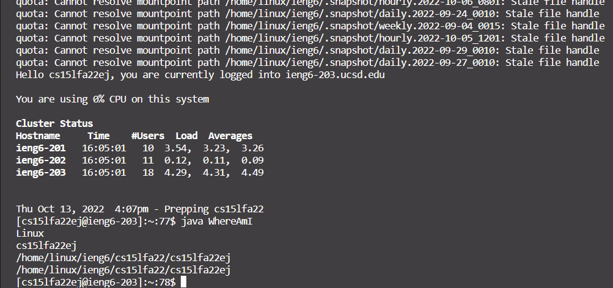

# Week 1 Lab Report

Dear diary,
This lab, I had an absolutely frustrating time logging in to the SSH. In fact, as of writing now, I STILL cannot log in.  
Luckilly, one of the tutors let me use their login so I could at least try some of the lab.

What we went over:
- Our cse15l Account!
- VS code
- Connecting to an ssh 
- Some command line... commands
- Moving files with command scp
- ssh keys
- Optimizing Remote Commands

------

## CSE15L Account
To log into our ssh, we needed our CSE15L course specific account.
We found this by going to the [account look up tool](https://sdacs.ucsd.edu/~icc/index.php) and logging in.

>The website
>>

The process should be pretty simple, but I encountered a big problem. We had to reset our passwords in order to initialize our accounts. For some reason, however, my passwords does not work still.

-----

## VS Code

Next we downloaded VS code. I already had it installed and running, so other than reading over the step, I did nothing. 

**If you wish to download VS Code, there are 3 simple steps!**

1. go to the [download page](https://code.visualstudio.com/)
2. download the installer for your device (mac, windows, linux)
3. run the installer!

> Me typing in VScode right now
>> 

---
## Connecting to the ssh

We then went to connect to the SSH via the command line.  
Boiled down, you essentially had to type this command:

    ssh cse15lfa22zz@ieng6.ucsd.edu

There are three parts to this line. 
1. ssh 
    - This is the ssh command. Put the place you want to connect after it
2. cse15lfa22zz
    - This is your username for the ssh. Replace zz with your account letters. eg: If your last two letters are ej, then cse15lfa22ej
3. @ieng6.ucsd.edu
    - Where you are connecting to. In this case, it would be ieng6 servers.
> This is me logging into the TA6 account because my password was not being accepted.

---
## Running Commands on ssh
Here, we started to run some command line... commands.  
Here are a few that we used
|Command|Function|
|-------|--------|
|cd     |change directory|
|ls     |lists files in current directory|
|cp     |copy; can be used on files and directories (?)
|cat    |prints contents of a file|
|mkdir  |makes a new directory

I image of me accessing my partners directory via TA account (probably cannot do this on a regular student account)
 

-----
## Moving files via scp
We learned how to... move files via scp

Broken down there are 3 steps:
1. Navigae to file location on local device
2. Input the scp command with your desired file path for ### and the remote ssh  
    like this:
    
    >scp ##### cse15lfa22zz@ieng6.ucsd.edu:~/

    
    after the "~/" you can put the directory path you want to scp to.

3. Log in, and then you're done! (unless you have a ssh key, then done on step 2)  
**Because I cannot log in to my ssh, and was instructed not to use the TA6 account, I cannot show a screenshot of this working**

### DEMO:

I have a file called `WhereAmI.java` whos only function is to print out the OS name, User, Root Directory, and Current Directory

Here is it running on my local files:

 

Now, I want to scp it to my SSH. The command
I will use will be
> `scp WhereAmI.java cs15lfa22ej@ieng6.ucsd.edu:~/`

Here it is in action:

You can see that it was successfully copied over to the ssh after I logged in.

Now after logging into the ssh, I can compile and run WhereAmI.java

-----
## ssh Keys

ssh keys allow you to log into an ssh automatically without needing to enter your password every single time you want to connect.  

An ssh key has two components: 
- the private key   (id_rsa) 
- the public key    (id_rsa.pub)

storing the ***PUBLIC*** key to the `/.ssh` directory on the ssh will allow you to connect to the ssh without needing to manually enter the password

### Creating an ssh key

First, we need to generate an ssh key!
We can do this by running the `ssh-keygen` command on our local client (your computer)

this creates your ssh keys in your `C:/user/.ssh/` folder
(if you are on windows)

Now, you need to make a new directory on the ssh to store your ssh key(s). In order to do this, you can use the command

> mkdir .ssh

while logged into the ssh to create a new directory called `.ssh`

Now for the last step. You need to scp your public key to your .ssh folder on the remote server.

Make sure you locate the path for `id_rsa.pub` (its probably in your `user/.ssh` folder)

Here is the command I used to send it:
> scp /Users/adria/.ssh/id_rsa.pub cs15lfa22ej@ieng6.ucsd.edu:~/.ssh/authorized_keys

after the "`:~/`" , I specified the folder it would go into, and where to save the key.

Now, I should be able to log in just fine without needing to enter my password!

...same line repeated...

As you can see, I did not get a password prompt, and now am logged in!

------

## Optimizing Remote Running

An easy way to optimize is to have all of your commands written and executed on a single line.   
Here is an example of a command that will connect to the ssh, and then compile and run WhereAmI.

    ssh cs15lfa22ej@ieng6.ucsd.edu "javac WhereAmI.java; java WhereAmI"

Here is another example of a command that will compile the WhereAmI file locally, port it to the ssh.

    javac WhereAmI.java; scp WhereAmI.java cs15lfa22ej@ieng6.ucsd.edu:~/ 
    
**Because I cannot log in to my ssh, and was instructed not to use the TA6 account, I cannot show a screenshot of this working**
